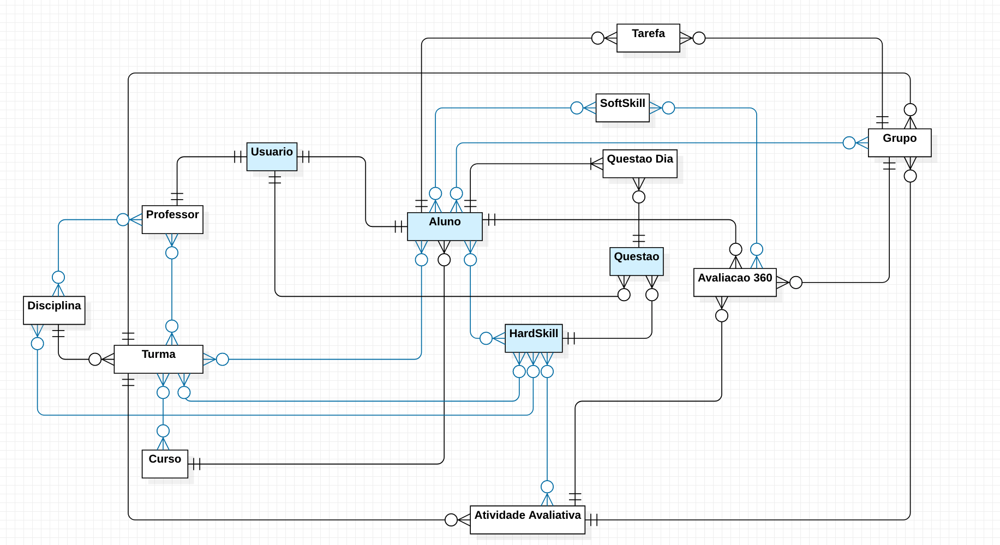

# Grupou! API REST

API REST do aplicativo Grupou! desenvolvida pelos alunos de Desenvolvimento de Aplicações Distribuídas da UniCarioca para a Atividade Avaliativa (AV2):

Alunos:
- Wallace Andrade da Silva - 2016200688
- Igor da Silva Cabral - 2016201106
- Daniel Henrique da Costa Ferreira - 2016200407
- Geraldo Araujo Vasques da Silva - 2016201534
- Marcos Vinicius Souza de Melo - 2017100040

